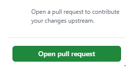

# One Way Folder Synchronization Script

[](https://www.python.org/downloads/)
[](https://github.com/Nazar-Pichak/One_Way_Folder_Sync/tree/main)
[](https://github.com/Nazar-Pichak/One_Way_Folder_Sync/network)
[](https://github.com/Nazar-Pichak/One_Way_Folder_Sync/stargazers)
[](https://github.com/Nazar-Pichak/One_Way_Folder_Sync/issues)
[](https://github.com/Nazar-Pichak/One_Way_Folder_Sync/graphs/contributors)
[](https://opensource.org/licenses/MIT)
[](https://github.com/Nazar-Pichak/One_Way_Folder_Sync/actions?query=workflow%3AGreetings)


<picture>
   <source srcset="https://fonts.gstatic.com/s/e/notoemoji/latest/1f441_fe0f/512.webp" type="image/webp">
   
</picture>
<picture>
   <source srcset="https://fonts.gstatic.com/s/e/notoemoji/latest/1f441_fe0f/512.webp" type="image/webp">
   
</picture>

# Overview
The code in the `main.py` is a Python script designed to synchronize the contents of a source directory with a destination directory. The script offers command-line arguments for flexibility, allowing users to specify paths for source and destination directories, define a log file location, and set a synchronization period.

### Key Features:

- **Source Directory**: Specify the folder whose contents you want to sync.
- **Destination Directory**: Define where the synced data should be stored.
- **Logging**: Set a path for storing logs related to the sync operation.
- **Sync Period**: Configure a delay period (in seconds) for regular synchronization.
- **Optional flag**: Optionaly filter out hidden files and directories from `destination folder`.

### Modules Used:

- `os`: For interacting with the operating system.
- `filecmp`: To compare files in `source` and `destination` directories.
- `shutil`: For copying files.
- `argparse`: For handling command-line arguments.
- `logging`: To implement logging of synchronization activities (copy/remove/update).
- `signal`: For handling process signals and graceful termination.
- `hashlig`: For generating hashes from each files in the `source directory`.
- `time`: For delaying regular synchronization.
- `stat`: For changing mode in files.
- `unittest`, `paytest`: For different types of testing.
- `tempfile`: For createting temporary files and directories for testing needs.

## Explanation and complexity 🤔

When file explorers count the memory size of hidden files and folders, they typically follow a set of steps that involve file system interactions and specific rules about what constitutes a "hidden" file. Here’s a detailed explanation of how this process generally works:

### 1. File System Interactions

File explorers interact with the file system to gather information about files and directories. The file system keeps track of various attributes of each file, including:

File Name: The name of the file or directory.
Size: The size of the file in bytes.
Attributes: Metadata that indicates whether a file is hidden, read-only, system, etc.

### 2. Identifying Hidden Files

Hidden files are usually identified based on certain attributes. The criteria for what constitutes a hidden file can vary between operating systems:

Windows: A file is hidden if it has the hidden attribute set in its properties. This can be checked using the file properties dialog or programmatically through system calls.
Unix/Linux: A file is considered hidden if its name starts with a dot (.). For example, .hiddenfile is a hidden file, while hiddenfile is not.

### 3. Traversing Directories

When counting the size of files in a directory, file explorers typically do the following:

Recursive Traversal: The explorer may traverse directories recursively, meaning it will go into each subdirectory and repeat the process of checking for files and folders.
Include/Exclude Hidden Files: Depending on the settings or the user’s preferences, the explorer may include or exclude hidden files in its size calculation.

### 4. Calculating Size

For each file or folder that the explorer encounters, it will perform the following steps:

Size Calculation:
For regular files, the explorer retrieves the size attribute and adds it to a running total.
For directories, the explorer may add the sizes of all files contained within them (including sizes of subdirectories and their files) to get the total size of that directory.

### 5. Displaying Results

After traversing the entire directory structure and calculating the sizes:

The explorer will typically display the total size of the selected directory and its contents, which can include both visible and hidden files, depending on user settings.
If the user has opted to show hidden files, those sizes will be included in the total. If not, they will be omitted.

## Useful researches 🔎

> **File explorers often do not include hidden files and folders in their calculations of memory size for a few key reasons related to user experience, system performance, and the nature of hidden files themselves.
> Based on this we can make decision that we can't see visually a whole memory size of the some folders in the file explorers (Windows, Linux, MacOS) even when we copy them. The original and copy looks the same,
> but in case copying via programming code operations we can run into a strange difference in memory size of original and a copy of the same folder.** 

## Installation and usage guide ⚙️

First ensure you have installed [Python](https://www.python.org/downloads/) and [pip](https://pip.pypa.io/en/stable/installation/) on your system.

**1. Upgrade your pip:**

```
python -m pip install --upgrade pip
```
   
**2. Clone repo:**

```
git clone https://github.com/Nazar-Pichak/One_Way_Folder_Sync.git
```

**3. Navigate into your git repo:**

```
cd >> cloned git repo
```

**4. Create virtual environment:**

```
python -m venv env
```
 
**5. Activate virtual environment:**

- For Windows
```
.venv\Scripts\activate         
```
- For Unix/macOS 
```
source .venv/bin/activate    
```
**6. Install dependencies into virtual environment:**

```
python -m pip install -r requirements.txt
```

**7. Run the code:**

- Navigate into `src` directory:
```
cd >> src\
```
- Run the script:
``` 
python main.py
```
- Enter needed arguments via command line (for conviniens):
```    
\xxx\src> "C:\Users\your_name\Desktop\source_dir"  "C:\Users\your_name\Desktop\dest_dir" "C:\Users\your_name\Desktop\logfile.log"  10 
   
```

**8. Results:**


So now it will create an identical copy of the `source directory` into previous desired place. As this is one way synchronization, we have to assume that `source directory` is a **main**.
To see general functionality, make any changes to the `source directory` by creating, deleting, updating files and folders while script is running with infinit loop.

<picture>
  <source srcset="https://fonts.gstatic.com/s/e/notoemoji/latest/1f680/512.webp" type="image/webp">
  
</picture>
<picture>
  <source srcset="https://fonts.gstatic.com/s/e/notoemoji/latest/1f680/512.webp" type="image/webp">
  
</picture>
<picture>
  <source srcset="https://fonts.gstatic.com/s/e/notoemoji/latest/1f680/512.webp" type="image/webp">
  
</picture>

## Contribution guide 📝

Contributions and improvements are wellcome as well. Please feel free to report any [issues](https://github.com/Nazar-Pichak/One_Way_Folder_Sync/issues) and bugs as this project is completely new.    

**1. Make your king Fork. This will create a copy of the repository in your GitHub account 👇👇👇**


**2. Clone Forked repository localy 👇👇👇**

```
 git clone https://github.com/Nazar-Pichak/One_Way_Folder_Sync.git
```
**3. Set Up the Upstream Remote**

- Navigate into the project:
```
cd >> cloned repo
```
- Add the original repository as an upstream remote to keep your fork in sync:
```
git remote add upstream https://github.com/Nazar-Pichak/One_Way_Folder_Sync.git
```
- Verify remotes with:
```
git remote -v
```
**4. Create a new branch**

- Before making any changes, create a new branch to keep your work organized and isolated.
- Run command:
```
git checkout -b your_branch_name
```

**5. Add your Python improvements to the code or documentation**

 
 
 


**6. Run tests and ensure all works fine with any breakdowns**

- Navigate into `test` directory:
```
>> cd test\
```
- Run test itself by invoking `pytest` framework:
```
pytest
```

<picture>
  <source srcset="https://fonts.gstatic.com/s/e/notoemoji/latest/2705/512.webp" type="image/webp">
  
</picture>
<picture>
  <source srcset="https://fonts.gstatic.com/s/e/notoemoji/latest/2705/512.webp" type="image/webp">
  
</picture>
<picture>
  <source srcset="https://fonts.gstatic.com/s/e/notoemoji/latest/2705/512.webp" type="image/webp">
  
</picture>
<picture>
  <source srcset="https://fonts.gstatic.com/s/e/notoemoji/latest/274c/512.webp" type="image/webp">
  
</picture>

##

<picture>
  <source srcset="https://fonts.gstatic.com/s/e/notoemoji/latest/2705/512.webp" type="image/webp">
  
</picture>
<picture>
  <source srcset="https://fonts.gstatic.com/s/e/notoemoji/latest/2705/512.webp" type="image/webp">
  
</picture>
<picture>
  <source srcset="https://fonts.gstatic.com/s/e/notoemoji/latest/2705/512.webp" type="image/webp">
  
</picture>
<picture>
  <source srcset="https://fonts.gstatic.com/s/e/notoemoji/latest/2705/512.webp" type="image/webp">
  
</picture>

##

**7. If all tests are passed ✅✅✅✅ then create commits and push changes**

- Once you’re happy with your changes, stage them:
```
git add .
```
- Commit them:
```
git commit -m "Description of changes made"
```
- Push Your Branch to Your Fork:
```
git push origin your_branch_name
```

**8. Open your king Pull Request. 👇👇👇**



<picture>
  <source srcset="https://fonts.gstatic.com/s/e/notoemoji/latest/1f44f/512.webp" type="image/webp">
  
</picture>
<picture>
  <source srcset="https://fonts.gstatic.com/s/e/notoemoji/latest/1f44f/512.webp" type="image/webp">
  
</picture>
<picture>
  <source srcset="https://fonts.gstatic.com/s/e/notoemoji/latest/1f44f/512.webp" type="image/webp">
  
</picture>

**9. Congratulations, you have done it.**

## 


   **&copy; 2024 by Nazar Pichak**


